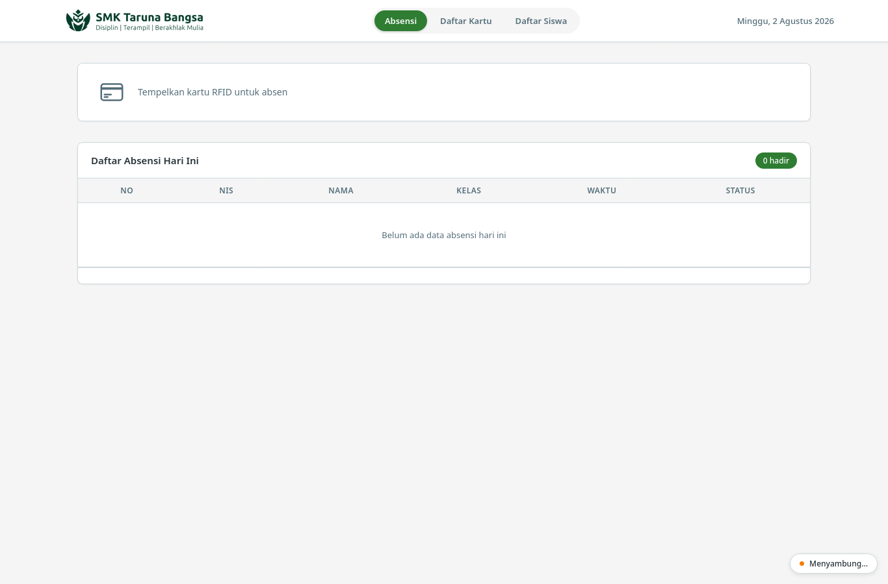
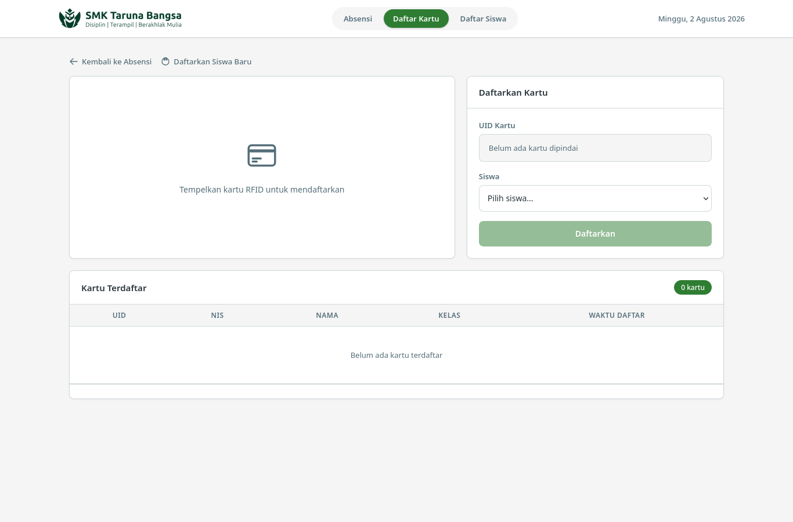
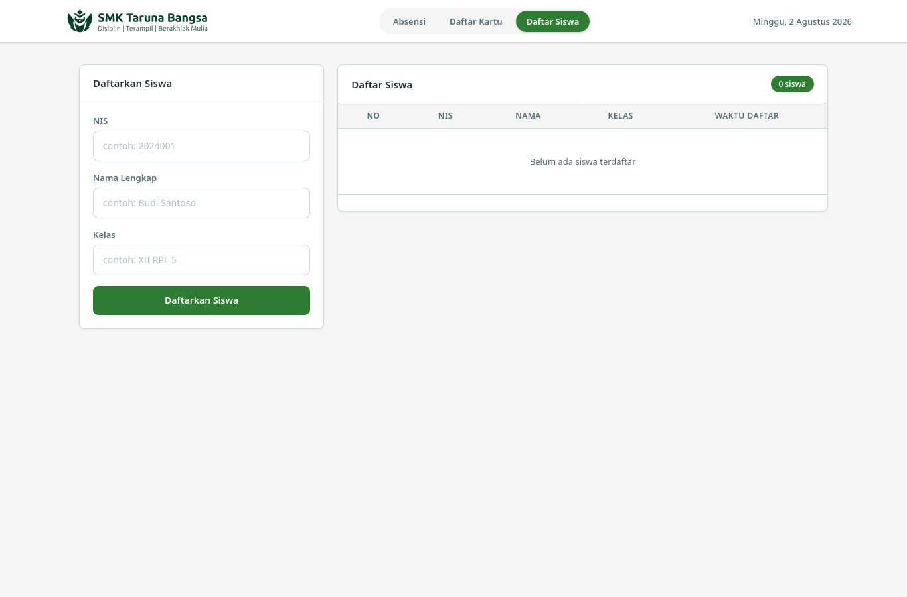

# Dokumentasi Sistem Absensi RFID

## Daftar Isi

- [Tangkapan Layar](#tangkapan-layar)
- [Arsitektur](#arsitektur)
- [Tech Stack](#tech-stack)
- [Struktur Proyek](#struktur-proyek)
- [Database](#database)
- [Endpoint API](#endpoint-api)
- [Rate Limiting](#rate-limiting)
- [Penanganan Error](#penanganan-error)
- [Cara Menggunakan](#cara-menggunakan)
- [Alur Kerja Sistem](#alur-kerja-sistem)
- [Environment Variables](#environment-variables)

---

## Tangkapan Layar

### Halaman Absensi (`/`)



### Halaman Registrasi Kartu (`/register`)



### Halaman Daftar Siswa (`/students`)



---

## Arsitektur

Sistem menggunakan arsitektur **layered architecture** dengan 4 lapisan:

```
Browser (EJS / CSS / JS)
       |
   [HTTP / SSE]
       |
Express Router (routes/)
       |
Service Layer (services/)
       |
Repository Layer (repositories/)
       |
  MySQL Database
```

| Lapisan | Peran |
|---------|-------|
| **View** | EJS templates + static files (CSS, JS) untuk UI |
| **Route** | Menangani HTTP request, validasi input via Zod (middleware `validate`), memanggil service |
| **Service** | Logic bisnis: proses absensi, tentu status tepat waktu/terlambat, registrasi kartu |
| **Repository** | Akses database via Drizzle ORM (parameterized queries), return typed results |

Komponen tambahan:

- **SSE (Server-Sent Events)**: Real-time push notifikasi dari server ke client ketika ada absensi baru (`/api/attendance/stream`)
- **Middleware**: `requestLogger` (log request), `errorHandler` (error handling terpusat), `asyncHandler` (wrapper async route), `validate`/`validateQuery` (Zod), `rateLimit` (anti-spam)
- **Graceful Shutdown**: Tangani `SIGTERM`/`SIGINT`, tutup HTTP server dan database pool dengan timeout 10 detik
- **Rate Limiting**: express-rate-limit untuk mencegah spam/tap berulang

---

## Tech Stack

| Teknologi | Versi | Kegunaan |
|-----------|-------|----------|
| Node.js | - | Runtime |
| TypeScript | ^5.6 | Type safety |
| Express.js | ^4.21 | HTTP framework |
| MySQL2 | ^3.11 | Database driver (dengan pool connection) |
| Drizzle ORM | ^0.45 | Query builder + schema typed |
| EJS | ^3.1 | Template engine |
| Zod | ^4.4 | Validasi request |
| Helmet | ^8.3 | Security headers (termasuk CSP) |
| express-rate-limit | ^8.6 | Rate limiting |
| dotenv | ^16.4 | Environment variables |
| tsx | ^4.19 | TypeScript runtime (dev) |

---

## Struktur Proyek

```
rfid_project/
├── database/
│   ├── schema.sql           # Skema database (DDL - referensi)
│   └── seed.sql             # Data awal (DML)
├── public/
│   ├── css/
│   │   └── style.css        # Stylesheet
│   ├── images/
│   │   └── logo.webp        # Logo sekolah
│   └── js/
│       ├── app.js           # Client JS halaman utama (SSE, fetch, UI)
│       ├── register.js      # Client JS halaman registrasi kartu
│       └── students.js      # Client JS halaman manajemen siswa
├── src/
│   ├── config/
│   │   ├── db.ts            # Koneksi database (pool mysql2)
│   │   └── env.ts           # Environment config (validasi Zod)
│   ├── db/
│   │   ├── index.ts         # Drizzle client
│   │   └── schema.ts        # Definisi tabel (students, cards, attendance, settings)
│   ├── middleware/
│   │   ├── asyncHandler.ts  # Wrapper async route handler
│   │   ├── errorHandler.ts  # Error handling terpusat (root cause aware)
│   │   ├── rateLimit.ts     # Rate limiter per-UID dan per-IP
│   │   ├── requestLogger.ts # Logging request
│   │   └── validate.ts      # Validasi body (validate) & query (validateQuery)
│   ├── repositories/
│   │   ├── attendance.ts    # Query absensi
│   │   ├── card.ts          # Query kartu
│   │   ├── setting.ts       # Query settings (dengan cache 60s)
│   │   └── student.ts       # Query siswa
│   ├── routes/
│   │   ├── attendance.ts    # API absensi + SSE
│   │   ├── cards.ts         # API registrasi/daftar kartu
│   │   ├── pages.ts         # Route halaman web (/, /register)
│   │   └── students.ts      # API daftar siswa
│   ├── services/
│   │   ├── attendance.ts    # Logic bisnis absensi
│   │   ├── cards.ts         # Logic registrasi kartu
│   │   └── students.ts      # Logic daftar siswa
│   ├── sse/
│   │   └── clients.ts       # Manajemen koneksi SSE (heartbeat, broadcast)
│   ├── types/
│   │   └── index.ts         # Type definitions
│   ├── utils/
│   │   ├── date.ts          # Tanggal/waktu timezone-aware + determineStatus
│   │   ├── error.ts         # rootCause() & isDuplicateEntryError()
│   │   └── format.ts        # Formatter respons
│   ├── validators/
│   │   ├── attendance.ts    # Zod schema absensi
│   │   ├── cards.ts         # Zod schema registrasi kartu
│   │   └── students.ts      # Zod schema registrasi siswa
│   ├── views/
│   │   ├── index.ejs        # Halaman utama absensi
│   │   ├── register.ejs     # Halaman registrasi kartu
│   │   ├── students.ejs     # Halaman manajemen siswa
│   │   └── partials/
│   │       ├── header.ejs   # Header (logo + tanggal)
│   │       ├── table.ejs    # Tabel daftar absensi
│   │       └── status.ejs   # Status koneksi + toast container
│   └── index.ts             # Entry point aplikasi
├── .env                     # Environment variables
├── package.json
├── tsconfig.json
├── BUGFIX_SUMMARY.md        # Ringkasan bug fixes
└── test-curl.sh             # Script testing API via curl
```

---

## Database

### Entity Relationship

```
students 1───* cards
students 1───* attendance
settings (key-value store)
```

### Tabel `students`

| Kolom | Tipe | Keterangan |
|-------|------|------------|
| id | INT UNSIGNED PK | Auto increment |
| nis | VARCHAR(32) | Nomor Induk Siswa |
| name | VARCHAR(128) | Nama siswa |
| class | VARCHAR(16) | Kelas |
| is_active | BOOLEAN | Status aktif (default TRUE) |

### Tabel `cards`

| Kolom | Tipe | Keterangan |
|-------|------|------------|
| id | INT UNSIGNED PK | Auto increment |
| uid | VARCHAR(32) UNIQUE | ID unik kartu RFID (unique index `uq_cards_uid`) |
| student_id | INT UNSIGNED FK | Foreign key ke students |
| is_active | BOOLEAN | Status aktif (default TRUE) |
| created_at | TIMESTAMP | Waktu kartu didaftarkan (nullable) |

### Tabel `attendance`

| Kolom | Tipe | Keterangan |
|-------|------|------------|
| id | INT UNSIGNED PK | Auto increment |
| student_id | INT UNSIGNED FK | Foreign key ke students |
| date | DATE | Tanggal absensi |
| time | TIME | Jam absensi |
| status | VARCHAR(20) | `Tepat Waktu` / `Terlambat` |

- **UNIQUE constraint** `unique_daily_attendance` pada `(student_id, date)` untuk mencegah duplikasi (race condition handling)

### Tabel `settings`

| Kolom | Tipe | Keterangan |
|-------|------|------------|
| key | VARCHAR(64) PK | Key setting |
| value | VARCHAR(255) | Value setting |
| description | VARCHAR(255) | Deskripsi |
| updated_at | TIMESTAMP | Diupdate |

**Default settings:**
- `late_threshold` = `07:00:00` (batas jam keterlambatan, dibaca dengan cache in-memory 60 detik)
- `school_name` = `SMK Negeri 1 Contoh`

> **Catatan:** `database/schema.sql` hanyalah referensi DDL. Definisi tabel resmi untuk aplikasi ada di `src/db/schema.ts`.

### Cara Setup

```bash
# 1. Buat database
mysql -u root -p -e "CREATE DATABASE rfid_attendance"

# 2. Import schema
mysql -u root -p rfid_attendance < database/schema.sql

# 3. Import seed data
mysql -u root -p rfid_attendance < database/seed.sql
```

---

## Endpoint API

Semua respons API berupa JSON. Endpoint yang tidak dikenal di bawah `/api/*` mengembalikan 404 JSON.

### 1. Health Check

```
GET /api/health
```

Cek status server dan koneksi database.

**Response 200:**
```json
{
  "status": "aman",
  "db": "tersambung",
  "timestamp": "2026-07-29T10:00:00.000Z"
}
```

**Response 503 (DB disconnect):**
```json
{
  "status": "error",
  "db": "disconnected",
  "timestamp": "2026-07-29T10:00:00.000Z"
}
```

---

### 2. Absensi (POST)

```
POST /api/attendance
Content-Type: application/json

{
  "uid": "0412A3B5C2D1"
}
```

Mencatat absensi berdasarkan UID kartu RFID.

**Rate limit:** 12 permintaan/menit per UID + 120 permintaan/menit per IP.

**Validasi UID:**
- Wajib diisi
- 8-24 karakter hexadecimal (0-9, A-F)
- Auto di-uppercase

**Response 200 (Berhasil):**
```json
{
  "success": true,
  "message": "Absensi berhasil",
  "student": {
    "name": "Bagas Tresna",
    "class": "XII RPL 5",
    "nis": "2024001"
  },
  "status": "Tepat Waktu",
  "time": "06:45:00"
}
```

**Response 409 (Duplikat - sudah absen hari ini):**
```json
{
  "is_duplicate": true,
  "message": "Sudah absen hari ini",
  "student": { "name": "...", "class": "...", "nis": "..." },
  "status": "Tepat Waktu",
  "time": "06:45:00"
}
```

**Response 404 (Kartu tidak dikenal):**
```json
{
  "success": false,
  "message": "Kartu tidak terdaftar"
}
```

**Response 400 (Validasi gagal):**
```json
{
  "success": false,
  "message": "Format UID tidak valid (8-24 karakter hex)"
}
```

**Response 429 (Rate limit):**
```json
{
  "success": false,
  "message": "Terlalu banyak percobaan, coba lagi dalam beberapa saat"
}
```

---

### 3. Daftar Absensi Hari Ini

```
GET /api/attendance/today?limit=100&offset=0
```

Mendapatkan daftar absensi hari ini dengan pagination.

**Query Parameters:**
| Parameter | Tipe | Default | Keterangan |
|-----------|------|---------|------------|
| limit | number (1-200) | 100 | Jumlah data per halaman |
| offset | number (>=0) | 0 | Offset data |

**Response 200:**
```json
{
  "success": true,
  "data": [
    {
      "id": 1,
      "student_id": 1,
      "date": "2026-07-29",
      "time": "06:45:00",
      "status": "Tepat Waktu",
      "student_name": "Bagas Tresna",
      "student_class": "XII RPL 5",
      "student_nis": "2024001"
    }
  ],
  "total": 50
}
```

---

### 4. SSE Stream (Real-time)

```
GET /api/attendance/stream
```

Koneksi Server-Sent Events untuk menerima notifikasi real-time ketika ada absensi baru.

**Event: `attendance:new`**
Dikirim ketika ada absensi berhasil.
```json
{
  "name": "Bagas Tresna",
  "class": "XII RPL 5",
  "nis": "2024001",
  "time": "06:45:00",
  "status": "Tepat Waktu"
}
```

**Event: `attendance:duplicate`**
Dikirim ketika ada percobaan absensi duplikat.

**Spesifikasi Koneksi:**
- Max 100 client bersamaan (lewat batas → 503)
- Heartbeat (komentar) setiap 30 detik
- Client dianggap mati setelah 90 detik tidak ada aktivitas
- Auto-reconnect di client **tanpa batas** dengan backoff 1s→2s→4s→... capped di 30 detik

---

### 5. Registrasi Kartu (POST)

```
POST /api/cards
Content-Type: application/json

{
  "uid": "0412A3B5C2D1",
  "student_id": 1
}
```

Mendaftarkan kartu RFID baru ke siswa tertentu.

**Rate limit:** 30 permintaan/menit per IP.

**Validasi:**
- `uid`: wajib, 8-24 karakter hex, auto-uppercase
- `student_id`: wajib, integer positif

**Response 200 (Berhasil):**
```json
{
  "success": true,
  "message": "Kartu berhasil didaftarkan",
  "student": { "name": "Bagas Tresna", "class": "XII RPL 5", "nis": "2024001" }
}
```

**Response 404 (Siswa tidak ditemukan):**
```json
{ "success": false, "message": "Siswa tidak ditemukan" }
```

**Response 409 (UID sudah terdaftar):**
```json
{ "success": false, "message": "UID kartu sudah terdaftar" }
```

---

### 6. Daftar Kartu Terbaru (GET)

```
GET /api/cards?limit=20&offset=0
```

Mendapatkan daftar kartu terdaftar (urut dari terbaru) dengan pagination.

**Query Parameters:**
| Parameter | Tipe | Default | Keterangan |
|-----------|------|---------|------------|
| limit | number (1-100) | 20 | Jumlah data per halaman |
| offset | number (>=0) | 0 | Offset data |

**Response 200:**
```json
{
  "success": true,
  "data": [
    {
      "id": 1,
      "uid": "0412A3B5C2D1",
      "is_active": true,
      "student_name": "Bagas Tresna",
      "student_class": "XII RPL 5",
      "student_nis": "2024001",
      "created_at": "2026-07-29 23:33:34"
    }
  ],
  "total": 12
}
```

`created_at` diformat sesuai timezone aplikasi (`YYYY-MM-DD HH:mm:ss`).

---

### 7. Daftar Siswa (GET, Pagination)

```
GET /api/students?limit=20&offset=0
```

Mendapatkan daftar siswa (urut dari terbaru) dengan pagination.

**Query Parameters:**
| Parameter | Tipe | Default | Keterangan |
|-----------|------|---------|------------|
| limit | number (1-100) | 20 | Jumlah data per halaman |
| offset | number (>=0) | 0 | Offset data |

**Response 200:**
```json
{
  "success": true,
  "data": [
    {
      "id": 1,
      "nis": "2024001",
      "name": "Bagas Tresna",
      "class": "XII RPL 5",
      "is_active": true,
      "created_at": "2026-07-29 23:33:34"
    }
  ],
  "total": 12
}
```

---

### 8. Registrasi Siswa (POST)

```
POST /api/students
Content-Type: application/json

{
  "nis": "2024001",
  "name": "Bagas Tresna",
  "class": "XII RPL 5"
}
```

Mendaftarkan siswa baru.

**Rate limit:** 30 permintaan/menit per IP.

**Validasi:**
- `nis`: wajib, maksimal 20 karakter (unique — duplikat ditolak)
- `name`: wajib, maksimal 100 karakter
- `class`: wajib, maksimal 20 karakter

**Response 200 (Berhasil):**
```json
{
  "success": true,
  "message": "Siswa berhasil didaftarkan",
  "student": { "nis": "2024001", "name": "Bagas Tresna", "class": "XII RPL 5" }
}
```

**Response 409 (NIS sudah terdaftar):**
```json
{ "success": false, "message": "NIS sudah terdaftar" }
```

---

### 9. Daftar Siswa Aktif (GET)

```
GET /api/students/active
```

Mendapatkan daftar siswa aktif untuk dropdown registrasi kartu.

**Response 200:**
```json
{
  "success": true,
  "data": [
    { "id": 1, "nis": "2024001", "name": "Bagas Tresna", "class": "XII RPL 5" }
  ]
}
```

---

### 10. Halaman Web

```
GET /             → Halaman utama absensi
GET /register     → Halaman registrasi kartu
GET /students     → Halaman manajemen siswa
```

**Halaman utama (`/`)** menampilkan:
- Kartu scan RFID (input UID)
- Daftar absensi hari ini (tabel dengan pagination 10/halaman)
- Status koneksi real-time
- Toast notification untuk absensi baru

**Halaman registrasi (`/register`)** menampilkan:
- Form daftarkan kartu (UID + pilih siswa)
- Tabel kartu terdaftar: UID, NIS, Nama, Kelas, Waktu Daftar (pagination 10/halaman)
- Error handling ramah: bedakan 409 duplikat / 404 siswa / 429 rate limit

**Halaman manajemen siswa (`/students`)** menampilkan:
- Form daftarkan siswa (NIS, Nama, Kelas)
- Tabel siswa terdaftar: NIS, Nama, Kelas, Waktu Daftar (pagination 10/halaman)
- Toast feedback sukses/gagal

Semua halaman memiliki navigasi di header: **Absensi | Daftar Kartu | Daftar Siswa**.

---

## Rate Limiting

Semua limiter memakai window 60 detik dan merespons `429` JSON.

| Endpoint | Limiter | Limit | Key |
|----------|---------|-------|-----|
| `POST /api/attendance` | `attendanceUidLimiter` | 12/menit | UID (fallback IP) |
| `POST /api/attendance` | `attendanceIpLimiter` | 120/menit | IP |
| `POST /api/cards` | `writeIpLimiter` | 30/menit | IP |
| `POST /api/students` | `writeIpLimiter` | 30/menit | IP |

Header `RateLimit-*` dikirim (standard `draft-8`).

> Catatan: key generator memakai `ipKeyGenerator()` dari express-rate-limit untuk kompatibilitas IPv6.

---

## Penanganan Error

Error handling terpusat di `src/middleware/errorHandler.ts` yang **menelusuri rantai `cause`** (penting: Drizzle ORM 0.45 membungkus error database ke dalam `DrizzleQueryError`, sehingga kode MySQL seperti `ER_DUP_ENTRY` ada di `cause`, bukan di level atas).

| Kondisi | Status | Pesan |
|---------|--------|-------|
| `ER_DUP_ENTRY` (duplikat) | 409 | `Data sudah ada dalam sistem` |
| `ECONNREFUSED`, `PROTOCOL_CONNECTION_LOST`, `ENOTFOUND`, `POOL_ENQUEUELIMIT`, `ECONNRESET` | 503 | `Database tidak dapat dihubungi` |
| Error database lain (`ER_*`) | 500 | `Terjadi kesalahan pada database` |
| Error lain (dengan `statusCode`) | sesuai | `Terjadi kesalahan pada server` |

Setiap error menyertakan `errorId` unik untuk memudahkan pencocokan dengan log server.

**Duplikasi absensi** juga di-handle di service layer (`isDuplicateEntryError`) untuk menangani race condition dua tap bersamaan pada siswa yang sama.

**Connection pool** (`src/config/db.ts`): `connectionLimit: 10`, `queueLimit: 100`, keep-alive aktif. Antrian penuh → `POOL_ENQUEUELIMIT` → 503 (mencegah request menggantung saat DB penuh).

---

## Cara Menggunakan

### 1. Persiapan

```bash
# Clone/download project
cd rfid_project

# Install dependencies
npm install
# atau
bun install

# Setup database
mysql -u root -p -e "CREATE DATABASE rfid_attendance"
mysql -u root -p rfid_attendance < database/schema.sql
mysql -u root -p rfid_attendance < database/seed.sql

# Konfigurasi environment (edit .env)
# PORT=3000
# DB_HOST=localhost
# DB_PORT=3306
# DB_USER=root
# DB_PASSWORD=your_password
# DB_NAME=rfid_attendance
# LATE_THRESHOLD=07:00:00
# APP_TIMEZONE=Asia/Jakarta
# CORS_ORIGIN=http://localhost:4321
```

### 2. Menjalankan

```bash
# Development
npm run dev
# atau
bun run src/index.ts

# Production
npm run build
npm start
```

### 3. Testing API

```bash
# Health check
curl http://localhost:3000/api/health

# Absen (UID valid dari seed data)
curl -X POST http://localhost:3000/api/attendance \
  -H "Content-Type: application/json" \
  -d '{"uid": "0412A3B5C2D1"}'

# Lihat daftar hari ini
curl "http://localhost:3000/api/attendance/today?limit=10&offset=0"

# Daftar kartu terdaftar
curl "http://localhost:3000/api/cards?limit=10&offset=0"

# Registrasi kartu baru
curl -X POST http://localhost:3000/api/cards \
  -H "Content-Type: application/json" \
  -d '{"uid": "0A1B2C3D4E5F", "student_id": 1}'

# SSE stream (terminal terpisah)
curl -N http://localhost:3000/api/attendance/stream
```

### 4. Seed Data (UID Kartu)

| Nama | NIS | UID Kartu |
|------|-----|-----------|
| Bagas Pratama | 2024001 | `0412A3B5C2D1` |
| Siti Aminah | 2024002 | `04F8C2A1B3E9` |
| Andi Saputra | 2024003 | `04A1D7F3C8B2` |
| Dewi Lestari | 2024004 | `04B9E2C7D1A6` |
| Rizky Ramadhan | 2024005 | `04C3F1A8B5D0` |
| Putri Handayani | 2024006 | `04D7B6C9E2F4` |
| Fajar Nugroho | 2024007 | `04E5A0D3F7C1` |
| Nabila Zahra | 2024008 | `04F2C8B1A6E3` |

> **Catatan:** `test-curl.sh` memakai UID tetap (mis. `A1B2C3D4E5F6`) yang akan tersimpan sebagai data asli di tabel `cards`. Hapus baris tersebut jika tidak diinginkan di data produksi.

---

## Alur Kerja Sistem

### Alur Absensi (Tap RFID)

```
1. Kartu RFID ditempelkan ke reader
2. Reader mengirim UID ke server via POST /api/attendance
3. Rate limit dicek (12/menit per UID, 120/menit per IP)
4. Server validasi format UID (Zod)
5. Server cari kartu aktif dengan UID tersebut (JOIN cards + students)
   ├── Jika tidak ditemukan → 404 "Kartu tidak terdaftar"
   └── Jika ditemukan:
       ├── Cek apakah sudah absen hari ini (UNIQUE constraint)
       │   ├── Jika sudah → 409 "Sudah absen hari ini" + SSE event attendance:duplicate
       │   └── Jika belum:
       │       ├── Tentukan status (Tepat Waktu / Terlambat)
       │       ├── Insert ke database
       │       │   ├── Jika ER_DUP_ENTRY (race condition) → handle graciously
       │       │   └── Jika sukses:
       │       │       ├── Broadcast via SSE ke semua client
       │       │       └── Response 200 ke reader
       │       └── (Error lain → throw, tangani di errorHandler)
```

### Alur Real-time (SSE)

```
1. Client browser connect ke GET /api/attendance/stream
2. Server registrasi client, kirim heartbeat (komentar) tiap 30 detik
3. Ketika ada absensi baru, server broadcast event ke semua client
4. Client JS menerima event, update UI (toast + animasi)
5. Jika koneksi putus, client auto-reconnect tanpa batas dengan backoff
   (1s, 2s, 4s, 8s, ... max 30s)
```

### Penentuan Status

```
current_time <= late_threshold → "Tepat Waktu"
current_time >  late_threshold → "Terlambat"
```

- `late_threshold` bisa dikonfigurasi via environment variable `LATE_THRESHOLD` (default: `07:00:00`)
- Bisa juga diset per-instansi via tabel `settings` key `late_threshold` (lebih prioritas dari env)
- Nilai dari database di-cache in-memory selama 60 detik untuk mengurangi beban query

### Waktu (Timezone)

Semua perhitungan tanggal/jam absensi memakai `Intl.DateTimeFormat` dengan timezone `APP_TIMEZONE` (default `Asia/Jakarta`) — tidak bergantung pada timezone OS/server.

---

## Environment Variables

| Variable | Default | Keterangan |
|----------|---------|------------|
| `PORT` | `3000` | Port server |
| `NODE_ENV` | `development` | Environment mode (`development`/`production`/`test`) |
| `CORS_ORIGIN` | `http://localhost:4321` | Origin CORS |
| `DB_HOST` | `localhost` | Host database |
| `DB_PORT` | `3306` | Port database |
| `DB_USER` | `root` | User database |
| `DB_PASSWORD` | (kosong) | Password database (wajib di production) |
| `DB_NAME` | `rfid_attendance` | Nama database |
| `LATE_THRESHOLD` | `07:00:00` | Batas jam keterlambatan (format HH:MM:SS) |
| `APP_TIMEZONE` | `Asia/Jakarta` | Zona waktu IANA untuk tanggal/jam absensi |

Di mode `production`, variabel wajib (`CORS_ORIGIN`, `DB_HOST`, `DB_USER`, `DB_PASSWORD`, `DB_NAME`) harus diisi — aplikasi akan menolak start dengan pesan error yang jelas jika kosong.

---
